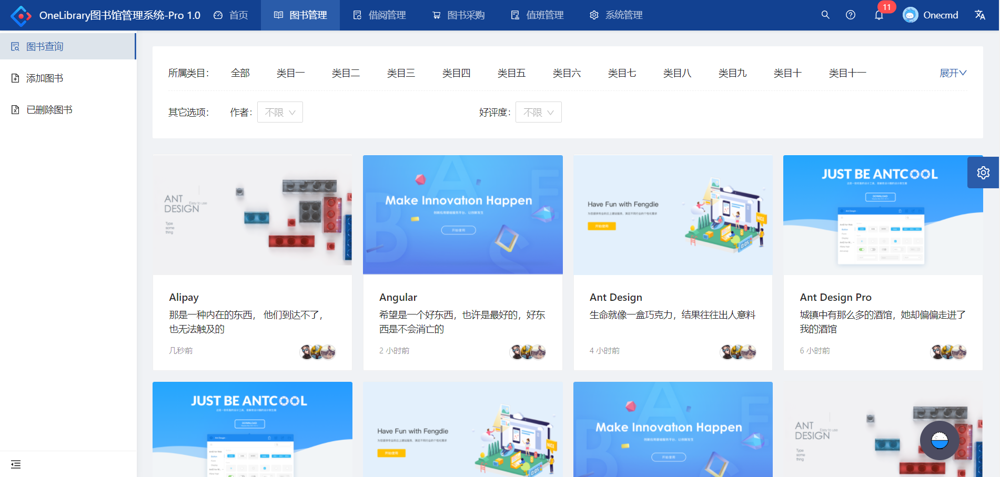

# Onelibrary-Pro

Onelibrary Pro version. It will support all functions of Onelibrary old version, and will provide a WeChat client. The backend will write by Golang, frontend will use Antd-pro. Welcome you follow and contribute us. More please contact: hebihong@163.com

Onelibrary Pro 版本是[Onelibrary](https://github.com/onecmd/onelibrary)升级版，适用于中小企业和组织内部图书馆的日常管理。Onelibrary 由我独立开发，并在诺基亚工会内部自 2014 年起开始投入使用。此 Pro 版将全新开发，将包含 Onelibrary 所有主要功能，采用新的架构和程序语言，增强性能、易用性和扩展性。敬请期待。如有需求和建议，欢迎联系 hebihong@163.com 。

### Pro 版特点：

- 后端采用 Golang 重新开发
- 前端改用 Ali Antd Pro 重新开发
- 提供微信小程序客户端，方便用户手机上查看和管理
- 支持 Docker 方式一键部署
- 支持部署到 Kubernetes
- 争取实现 Onelibrary 到 Pro 的平滑升级

### 功能摘要：

- 图书管理
- 借阅管理
- 图书采购管理
- 值班管理
- 图书馆会员管理
- 图书馆管理员和志愿者管理
- 系统管理
